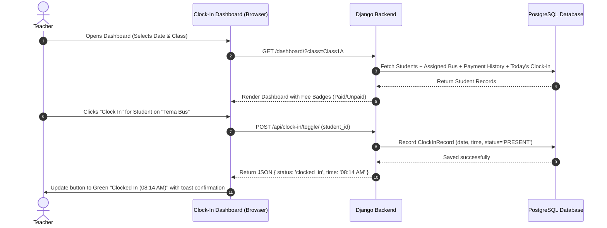
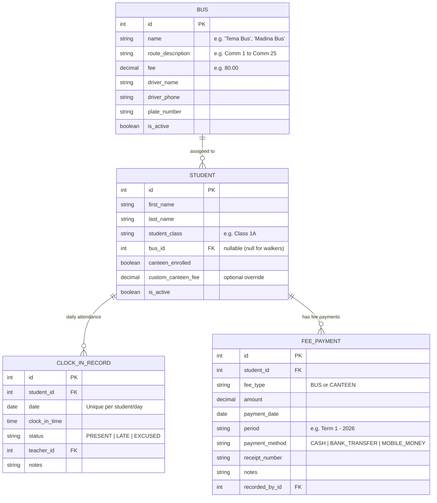

# Implementation Plan: School Clock-In & Fee Tracking System

## 1. System Overview & Objectives

The **School Clock-In & Fee Tracking System** is a purpose-built Django web application for schools. It solves two critical daily operations in one seamless interface:
1. **Student Arrival / Clock-In Attendance**: Enabling teachers to quickly take morning attendance and clock in students in real-time.
2. **Instant Fee Verification (Bus & Canteen)**: Providing teachers with immediate, color-coded visibility into whether a student has paid their canteen and bus fees right at the moment of clock-in.

### Key Rule for Bus Fees:
> **Dynamic Bus Fees by Bus Name**: Fees are not one-size-fits-all. Different buses ply different routes (e.g. **Tema Bus**, **Madina Bus**, **Spintex Bus**, **Adenta Bus**). Each bus has its own distinct fee configured by the school administrator. When a student is assigned to a bus, their expected bus fee is automatically determined by that bus.

---

## 2. User Roles & Daily Workflows

### A. School Administrator Workflow
1. **Bus Management**:
   - Creates and names buses (e.g. **"Tema Bus"**, **"Madina Bus"**, **"Kasoa Express"**).
   - Sets the specific fee amount for each bus route (e.g., *Tema Bus = $80.00*, *Madina Bus = $50.00*).
   - Records optional driver name, phone number, and vehicle registration plate.
2. **Student Enrollment**:
   - Enrolls students with first name, last name, and class (e.g. **"Class 1A"**, **"Class 2B"**) — no student ID required.
   - Assigns each student to their designated bus (or leaves unassigned for walkers/private drop-offs).
   - Configures canteen participation (enrolled or opted-out) and standard canteen fee.
3. **Fee Record Keeping & Payments**:
   - Records fee payments made by parents (Bus Fee or Canteen Fee), issuing a receipt number.
   - Generates summary reports on total collected vs outstanding fees.

### B. Teacher Daily Clock-In Workflow
1. **Morning Clock-In**:
   - The teacher opens the Clock-In Dashboard on their tablet, laptop, or phone.
   - Can filter students by class (e.g., **"Class 1A"**) or by bus (e.g., "Show students boarding **Tema Bus**").
   - Quick search by student name.
2. **Instant Fee Check**:
   - For each student, the teacher sees instant status badges:
     - 🚌 **Bus Badge**: e.g., `Tema Bus: Paid ($80.00)` (Green) OR `Tema Bus: Unpaid (Owes $80.00)` (Red/Amber).
     - 🍽️ **Canteen Badge**: `Canteen: Paid` (Green) OR `Canteen: Unpaid` (Red/Amber).
3. **One-Click Clock-In**:
   - Teacher taps the **"Clock In"** button next to the student's name.
   - The system instantly stamps the arrival time (e.g. `08:12 AM - Present`) without a full-page reload (using AJAX).
   - Summary counters at the top of the screen (Total Clocked In, Unpaid Bus Fees, Unpaid Canteen Fees) update dynamically.

---

## 3. Workflow & Data Flow Diagrams

### Daily Clock-In & Verification Flow


### Entity Relationship Model


---

## 4. Technical Architecture & Database Design

### Tech Stack
- **Backend**: Python 3.11 + Django 5.x
- **Database**: PostgreSQL 18.x with `psycopg` (v3) database adapter
- **Configuration**: `python-dotenv` for secure environment-based PostgreSQL credentials
- **Frontend**: Django Templates + Vanilla CSS Design System + Vanilla JS for asynchronous clock-in toggling
- **Static Assets**: WhiteNoise for robust local and production static file serving

### Environment & Database Settings (`.env`)
```env
DEBUG=True
SECRET_KEY=django-insecure-school-clockin-demo-key-2026
DB_NAME=school_clockin_db
DB_USER=postgres
DB_PASSWORD=postgres
DB_HOST=localhost
DB_PORT=5432
DEFAULT_CANTEEN_FEE=45.00
CURRENT_ACADEMIC_PERIOD=Term 1 - 2026
```

---

## 5. Detailed Component Specifications

### Component 1: Bus Management (Admin)
- **Model**: `Bus`
  - `name`: Admin-provided label (e.g. `"Tema Bus"`, `"Madina Bus"`, `"Airport Residential Bus"`, `"Campus Shuttle"`).
  - `fee`: Exact fee assigned to this route (e.g. 120.00).
  - `route_description`: List of major stops and pickup points.
  - `driver_name` / `driver_phone` / `plate_number`.
- **Pages**:
  - `BusListView`: Table of all configured buses with active student counts and total revenue expected.
  - `BusCreateUpdateView`: Simple modal/form to add or edit bus names and their fees.

### Component 2: Student Roster & Fee Logic
- **Model**: `Student`
  - `first_name`: `CharField(max_digits=50)`
  - `last_name`: `CharField(max_digits=50)`
  - `student_class`: `CharField(max_digits=50)` (e.g. **"Class 1A"**, **"Class 2B"**, **"Nursery 1"**)
  - `bus`: `ForeignKey(Bus, on_delete=SET_NULL, null=True, blank=True)`
  - `canteen_enrolled`: `BooleanField(default=True)`
  - `is_active`: `BooleanField(default=True)`
  - Helper properties:
    - `bus_fee_required`: Returns `bus.fee` if assigned to a bus (e.g. $80.00 for Tema Bus), else $0.00.
    - `canteen_fee_required`: Returns standard canteen fee ($45.00) or 0 if not enrolled.
    - `bus_paid_amount`: Total payments recorded for this student under fee type `'BUS'` for current period.
    - `canteen_paid_amount`: Total payments recorded for this student under fee type `'CANTEEN'` for current period.
    - `is_bus_paid`: Boolean check (`bus_paid_amount >= bus_fee_required`).
    - `is_canteen_paid`: Boolean check (`canteen_paid_amount >= canteen_fee_required`).
    - `today_clock_in`: Returns today's `ClockInRecord` if clocked in, else `None`.

### Component 3: Teacher Clock-In Dashboard
- **Screen Layout**:
  1. **Header & Date Banner**: Today's date, current term/period, teacher name.
  2. **Stat Cards**:
     - Total Students
     - Clocked In Today (Count & %)
     - Bus Fee Paid (% of bus riders)
     - Canteen Fee Paid (% of enrolled)
  3. **Control Bar**:
     - Search student by name.
     - Class dropdown filter (e.g. **"Class 1A"**, **"Class 2B"**, "All Classes").
     - Bus dropdown filter (e.g. "All Buses", **"Tema Bus"**, **"Madina Bus"**, "Walkers / No Bus").
     - Fee filter ("All", "Unpaid Bus Fee Only", "Unpaid Canteen Fee Only").
  4. **Student Attendance Table**:
     - Student Name (First & Last) & Avatar initials
     - Class (e.g. **Class 1A**)
     - **Assigned Bus**: Displays bus name with fee pill (e.g., `Tema Bus ($80.00)`)
     - **Bus Fee Status**:
       - 🟢 `Paid ($80.00)`
       - 🔴 `Unpaid (Owes $80.00)`
       - ⚪ `No Bus` (for walkers)
     - **Canteen Fee Status**:
       - 🟢 `Paid ($45.00)`
       - 🔴 `Unpaid (Owes $45.00)`
       - ⚪ `Not Enrolled`
     - **Action**:
       - If not clocked in: Blue button `[ Clock In ]`
       - If clocked in: Green badge `[ ✓ Clocked In at 08:14 AM ]` with subtle undo option.

### Component 4: Fee Payments & History
- **Modal / Page**: Fast "Record Payment" button.
  - Allows teacher or admin to select student, pick fee type (Bus Fee or Canteen Fee), input amount, payment method (Cash, Mobile Money, Bank), and receipt number.
  - Immediately updates the student's status badge on the dashboard.

---

## 6. Proposed Project Structure

```
d:\clockIn\
├── clockin_project/
│   ├── __init__.py
│   ├── asgi.py
│   ├── settings.py           # Configured for PostgreSQL with .env
│   ├── urls.py               # Main URL router
│   └── wsgi.py
├── attendance/
│   ├── __init__.py
│   ├── admin.py              # Django admin registrations for Bus, Student, Payment, ClockIn
│   ├── apps.py
│   ├── models.py             # Bus, Student, FeePayment, ClockInRecord
│   ├── forms.py              # BusForm, StudentForm, FeePaymentForm
│   ├── views.py              # Dashboard, Bus CRUD, Student CRUD, Payment, ClockIn API
│   ├── urls.py               # App URL routes
│   └── tests.py              # Automated unit tests for bus fee logic & clock-in
├── templates/
│   ├── base.html             # Base layout with navigation and alert messages
│   └── attendance/
│       ├── dashboard.html    # Teacher Clock-In & Fee dashboard
│       ├── buses.html        # Admin Bus creation & fee configuration (Tema Bus, etc.)
│       ├── bus_form.html     # Add/edit bus modal/page
│       ├── students.html     # Student roster & bus assignment
│       ├── student_form.html # Add/edit student modal/page
│       ├── payments.html     # Fee payments ledger & record payment
│       └── reports.html      # Daily clock-in & fee reconciliation report
├── static/
│   ├── css/
│   │   └── style.css         # Modern, responsive design system
│   └── js/
│       └── clockin.js        # Dynamic search, filtering, and 1-click AJAX clock-in
├── .env.example
├── .env
├── manage.py
└── requirements.txt
```

---

## 7. Verification & Testing Strategy

### Automated Tests (`python manage.py test attendance`)
1. **Bus & Fee Pricing Tests**:
   - Verify creating a bus named `"Tema Bus"` with a fee of `80.00` and `"Madina Bus"` with `50.00`.
   - Verify assigning students to `"Tema Bus"` sets their required bus fee to `80.00`.
   - Verify walker students have a required bus fee of `0.00`.
2. **Fee Payment & Calculation Tests**:
   - Test student with partial payment shows as unpaid/balance due.
   - Test student with full payment shows `is_bus_paid = True`.
   - Test canteen payment calculation independently from bus fee.
3. **Clock-In API Tests**:
   - Test clocking in a student creates a `ClockInRecord` for today's date.
   - Test idempotency (preventing duplicate clock-ins for the same student on the same day).
   - Test un-clocking/undo functionality.

### Manual Verification
1. Launch Django server and connect to PostgreSQL.
2. Log into Admin / Dashboard:
   - Create buses: **Tema Bus** ($80.00) and **Madina Bus** ($50.00).
   - Create students: Student A assigned to Tema Bus, Student B assigned to Madina Bus, Student C with No Bus (Walker).
   - Record payments: Pay Tema Bus fee for Student A; leave Student B unpaid.
3. Open Teacher Clock-In Dashboard:
   - Confirm Student A displays `Tema Bus: Paid ($80.00)` and Student B displays `Madina Bus: Unpaid (Owes $50.00)`.
   - Perform clock-in for Student A and Student B, verifying real-time timestamp updates and counters.
   - Test the bus filter dropdown (filter specifically by "Tema Bus").
